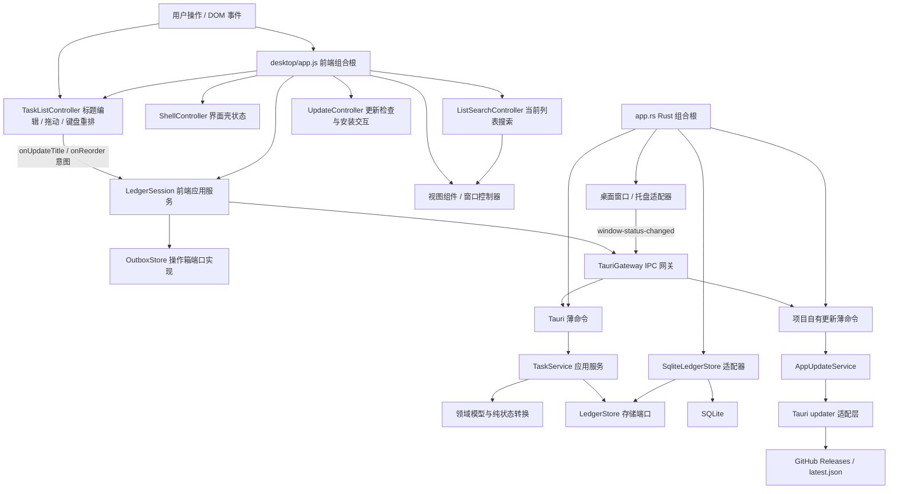

# 代办：代码架构与模块边界 v0.1

> 状态：当前模块化、统一待办列表、可追溯修改、Windows 打包与自动更新边界的实现基线
> 更新时间：2026-07-22
> 适用范围：Tauri 桌面壳、前端账本会话、本地任务账本、发布更新与联合冒烟；不代表阶段 1 全部产品能力或版本间升级闭环已经完成

## 1. 目标

当前模块边界不引入新的任务状态；界面层已经把“现在做”和“接下来”合并为统一待办列表，并允许修改未完成标题、设置可选期限、逐项完成和调整顺序。目标是让后续增加“稍后再做、被卡住、不再做和周报”时，不需要继续把逻辑堆进单个入口文件：

1. 任务、事件和金币规则只保留一份权威实现。
2. 窗口、前端编排、领域规则、持久化和冒烟验证各自有明确边界。
3. IPC 命令名、参数口径、SQLite 结构和操作箱恢复协议在重构中保持兼容。
4. 只采用能直接减少重复或约束状态演进的轻量模式，不为“看起来分层”增加空抽象。
5. 标题/期限修改、任意待办完成、队列重排和跨版本迁移都由同一条可靠写入链路处理，界面不维护第二份任务事实。
6. 更新检查与安装通过项目自有命令和 Rust 适配层收口，smoke 在前后端两层禁止访问更新网络。

这份文档是代码结构的入口说明；业务状态语义仍以[《任务状态与事件账本 v0.1》](./任务状态与事件账本-v0.1.md)为准，持久化实验结论仍以[《本地事件历史、金币账本与异常恢复技术实验 v0.1》](./本地事件历史、金币账本与异常恢复技术实验-v0.1.md)为准，发布操作和当前验证状态见[《Windows 发布与自动更新 v0.1》](./Windows发布与自动更新-v0.1.md)。

## 2. 为什么这样拆

当前应用同时包含两类性质不同的能力：

- 核心领域逻辑：任务状态转换、事件事实、金币净值、幂等命令和异常恢复。这些规则决定数据是否正确，必须由 Rust 领域层统一掌握。
- 通用工程能力：Tauri IPC、窗口控制、SQLite、浏览器存储、页面渲染、测试运行器。这些能力通过边界适配，不进入领域模型。

前端继续使用原生 ES 模块（ES modules）与 JSDoc，不引入构建器；Tauri 可以直接承载静态前端资源，符合当前桌面小工具的体量与离线边界，依据见 [Tauri 前端配置](https://v2.tauri.app/start/frontend/)。前端测试采用 Node.js 内置测试运行器，通过 `node --test` 执行，不增加测试框架依赖，依据见 [Node.js 测试运行器](https://nodejs.org/api/test.html)。

Rust 侧保留项目自己的领域类型与存储端口，把 `rusqlite` 和 Tauri 放在边缘。这样既能复用成熟通用能力，又不会让 SQL、窗口句柄或框架错误类型污染任务模型。

## 3. 当前目录与职责

```text
todo/
├─ desktop/
│  ├─ index.html                 页面结构与单一宠物模板
│  ├─ styles.css                 当前极简原生样式
│  ├─ app.js                     前端组合根：装配会话、视图、界面壳、窗口控制与事件入口
│  ├─ app/
│  │  ├─ state.js               账本页面状态与轻量可观察状态容器
│  │  ├─ ledger-contract.js     IPC 快照校验、命令协议与确定性拒绝分类
│  │  ├─ ledger-session.js      前端账本应用服务：操作箱、恢复、刷新与写入时序
│  │  ├─ selectors.js           只读派生数据
│  │  ├─ views.js               统一待办列表与完成记录的无业务规则 DOM 视图
│  │  ├─ task-list-controller.js 列表交互控制器：行内标题/期限编辑、重排预览与焦点恢复
│  │  ├─ list-search-controller.js 当前列表搜索、输入法与搜索焦点临时状态
│  │  ├─ shell-controller.js    待办/完成记录页、更多菜单与 Esc 临时状态
│  │  ├─ window-controller.js   窗口意图编排与 Rust 状态事件同步
│  │  ├─ update-controller.js   正常模式更新检查时机、提示与用户确认安装
│  │  ├─ pet-component.js       保留技术模式的宠物模板挂载；当前主界面不使用
│  │  └─ infrastructure/
│  │     ├─ tauri-gateway.js    IPC 网关与 camelCase 参数映射
│  │     └─ outbox-store.js     正常/冒烟操作箱存储策略与仓储实现
│  └─ tests/                    DOM 契约、界面壳、网关/操作箱、会话恢复测试
├─ src-tauri/src/
│  ├─ main.rs                   进程入口与 CLI 冒烟分流
│  ├─ app.rs                    Rust 组合根：注册状态、命令、插件和生命周期
│  ├─ runtime_profile.rs        normal/smoke 运行配置及独立状态文件策略
│  ├─ frontend_probe.rs         前端就绪报告与等待状态
│  ├─ integration_smoke.rs      只消费生产接口的桌面联合冒烟
│  ├─ app_update/
│  │  ├─ commands.rs           项目自有检查/安装更新薄命令
│  │  ├─ service.rs            normal 校验、待安装版本、安装锁与 updater 适配
│  │  └─ mod.rs                更新模块出口
│  ├─ desktop/
│  │  ├─ state.rs              WindowMode、WindowSpec、DesktopState、WindowStatus
│  │  ├─ commands.rs           桌面 Tauri 薄命令
│  │  ├─ window.rs             Tauri 窗口适配与生命周期动作
│  │  └─ tray.rs               托盘适配与恢复/退出入口
│  ├─ window_geometry.rs        不依赖 Tauri 的几何纯逻辑
│  └─ ledger/
│     ├─ domain.rs             实体、错误码、输入校验、标题/期限修改、完成、删除、重排的纯领域转换
│     ├─ service.rs            TaskService 应用服务、标题/期限修改、任意项完成、删除、重排用例与 LedgerStore 端口
│     ├─ commands.rs           账本 Tauri 薄命令与错误映射
│     ├─ mod.rs                LedgerState 门面及桌面运行时装配类型
│     ├─ sqlite.rs             SqliteLedgerStore、原子提交与 v1 迁移前一致性备份
│     ├─ sqlite/schema.rs      数据库身份、schema v4 与 v1 → v2 → v3 → v4 结构迁移
│     ├─ sqlite/integrity.rs   事件回放队列、标题/期限历史与数据库投影/回执一致性验证
│     ├─ smoke.rs              账本异常退出冒烟运行入口
│     └─ smoke/tests.rs        账本回归测试
├─ scripts/check-release-version.mjs package、Tauri 与 Cargo 发布版本一致性检查
├─ .github/workflows/release.yml Windows 发布工作流
└─ docs/                        产品、技术实验、源码证据与本架构说明
```

`styles.css` 暂时保持单文件，因为当前样式仍围绕一个页面且没有产生重复主题实现；是否拆分样式应由组件边界和复用事实决定，而不是机械地追求文件数量。

## 4. 依赖方向



依赖方向遵守以下规则：

- 页面视图不直接发账本写命令；所有写入先经过 `LedgerSession`。
- `TaskListController` 只维护当前行内编辑与拖动预览：标题变化通过 `onUpdateTitle(taskId, title)` 提交，重排通过 `movedTaskId + expectedTaskIds + orderedTaskIds` 提交；它不依赖 `TauriGateway`，也不直接写账本。
- `ListSearchController` 只维护当前页面、规范化查询、输入法组合态和焦点；`selectors.js` 从账本快照纯过滤，`LedgerView` 每次真实快照重绘后重新应用查询。搜索不进入 `LedgerSession`、IPC 或 SQLite。
- `UpdateController` 只在 normal 模式启动，负责启动时检查、24 小时间隔、菜单文案和用户安装动作；它通过 `TauriGateway` 调用项目自有命令，不直接使用 updater 插件 API。
- `TauriGateway` 知道 IPC 字面量，应用层只调用有语义的方法。
- Tauri 命令只负责输入输出映射，不实现任务状态或金币规则。
- `TaskService` 依赖项目自己的 `LedgerStore` 端口；SQLite 适配器实现该端口，反向依赖不成立。
- `domain.rs` 不依赖 Tauri、SQLite、DOM 或浏览器存储。
- `AppUpdateService` 在创建 updater 或访问网络前校验 normal 模式，并掌握待安装版本与单次安装锁；smoke 请求显式失败，不回退到其他网络路径。
- 窗口模式改变后，由 Rust 适配器发布 `window-status-changed`；前端网关订阅后交给 `WindowController` 更新 DOM，托盘回调不直接操作页面状态。
- `integration_smoke.rs` 可以单向依赖 `runtime_profile.rs` 和 `frontend_probe.rs` 的生产接口；运行配置与前端探针不得反向依赖冒烟模块。当前更细的方向是 `frontend_probe → runtime_profile`、`integration_smoke → runtime_profile + frontend_probe`。

## 5. 关键输入与输出

| 边界 | 关键输入 | 关键输出 | 责任 |
|---|---|---|---|
| 页面 → `LedgerSession` | 新任务标题、待修改标题/期限与任务 ID、要完成或删除的待办 ID、被移动任务与调整前后完整顺序、完成事件 ID | 操作结果或显式错误 | 接收用户意图，不自行改变领域事实 |
| DOM → `TaskListController` | 标题双击/键盘/失焦、期限控件或标签、拖动手柄、`Alt + ↑/↓`、当前列表顺序 | `taskId + title`、`taskId + deadlineOn` 或完整重排意图 | 只维护编辑/重排临时状态并提交意图；不接触 Gateway 或账本 |
| DOM → `ListSearchController` | 当前页面、`Ctrl+F` / 菜单、搜索输入、输入法组合事件、取消 / `Esc` | `{ panel, query }` 临时视图状态 | 只筛选当前页面标题和管理焦点；不提交账本命令 |
| DOM / 定时器 → `UpdateController` | normal 运行配置、启动检查、24 小时间隔、菜单点击 | 更新状态、提示或安装意图 | 只编排更新交互，不保存安装事实或直接访问网络 |
| `LedgerSession` → 操作箱 | `key`、稳定 `operationId`、命令、payload、`committed` | 可恢复的待确认操作 | IPC 前先保存；结果未知时保留 |
| `TauriGateway` → Tauri 命令 | 稳定命令名与 camelCase payload | 运行配置、窗口状态、账本快照、回执、完整性报告 | 隔离 IPC 字面量和参数映射 |
| 更新薄命令 → `AppUpdateService` | 检查请求或 `expectedVersion` | 当前/可用版本，或显式更新错误 | 校验运行模式、待安装版本和并发安装状态 |
| `AppUpdateService` → updater / GitHub Releases | 当前应用版本、更新端点、签名公钥 | `latest.json`、签名更新产物或无更新 | 通过 Tauri updater 下载并校验，不向领域层泄漏插件类型 |
| Tauri 命令 → `TaskService` | Rust 字符串/ID、标题/期限修改与删除目标、调整前后任务 ID 列表 | 领域对象或稳定 `CommandError` | 薄适配，不复制业务判断 |
| `TaskService` → 领域转换 | 已校验输入、当前事实、时钟与 ID | `LedgerMutation` | 用例编排、幂等回执检查 |
| `TaskService` → `LedgerStore` | 命令类型、请求指纹、完整变化集 | `MutationReceipt` 或显式错误 | 只通过端口访问持久化 |
| `SqliteLedgerStore` → SQLite | 任务投影、事件、奖励、回执 | 同一事务全部提交或全部回滚 | 数据原子性和持久化一致性 |
| 窗口控制器 ↔ 桌面适配层 | 模式、是否请求焦点；返回值或 `window-status-changed` 事件 | `WindowStatus` | 将窗口意图交给 Rust，并以 Rust 实际状态同步 DOM |
| 页面事件 → `ShellController` | 待办页、完成记录页、更多菜单、Esc | `body[data-panel]` 与菜单开关 | 只管理临时界面状态，不发账本或窗口命令 |

已公开的 IPC 名称与 payload 是跨语言协议，重构时保持稳定：`runtime_profile`、`report_frontend_ready`、`window_status`、`set_window_mode`、`hide_to_tray`、`capture_task`、`update_task_title`、`update_task_deadline`、`complete_task`、`delete_task`、`reorder_tasks`、`undo_completion`、`ledger_snapshot`、`weekly_facts`、`ledger_integrity`、`check_for_update`、`install_update`。标题修改协议为 `update_task_title({ taskId, title, operationId })`；期限修改协议为 `update_task_deadline({ taskId, deadlineOn, operationId })`，其中 `deadlineOn` 只能是 `null` 或 `YYYY-MM-DD`；删除协议为 `delete_task({ taskId, operationId })`，队列调整协议为 `reorder_tasks({ movedTaskId, expectedTaskIds, orderedTaskIds, operationId })`；安装更新协议为 `install_update({ expectedVersion })`。窗口状态另通过 `window-status-changed` 事件由 Rust 主动同步。新增能力应扩展网关与薄命令，不能让页面散落调用字面量。

## 6. 状态所有者

| 状态 | 唯一所有者 | 非所有者可以做什么 |
|---|---|---|
| 任务状态、队列顺序、事件、奖励和命令回执 | Rust 领域层 + SQLite 账本 | 前端只提交意图并渲染快照 |
| 领域写入时序与幂等检查 | `TaskService` | Tauri 命令只转发 |
| 页面阶段、当前快照、待确认操作、刷新序号 | `LedgerSession` / `state.js` | 视图只订阅和派生展示 |
| 正常模式恢复凭据 | `LocalStorageOutboxStore` | 会话通过统一接口保存、读取、清理 |
| 冒烟模式临时恢复凭据 | `MemoryOutboxStore` | 不接触正常模式 localStorage |
| 窗口模式、可聚焦和托盘就绪 | Rust `DesktopState` | 前端窗口控制器发送意图，并应用命令返回值或 `window-status-changed` 事件 |
| 模式对应的尺寸、焦点与贴边策略 | `WindowMode::spec()` 返回的 `WindowSpec` | 窗口适配器执行策略，不再重复常量 |
| normal/smoke 当前运行配置 | Rust `RuntimeProfile` | 前端读取后选择操作箱，组合根据此选择数据库与状态文件 |
| 前端是否真正就绪 | `FrontendProbeState` | 前端只在快照可用且进入 `ready` 后上报；联合冒烟只等待和验证 |
| 待办/完成记录页与更多菜单 | `ShellController` | 视图只按 `body[data-panel]` 显示；Esc 依次收束临时界面 |
| 当前列表搜索页面、查询与输入法组合态 | `ListSearchController` | 选择器只纯过滤；视图只安全高亮；账本与队列顺序不感知搜索 |
| 行内编辑、拖动预览与重绘后的焦点恢复 | `TaskListController` | 只维护当前交互的临时状态；最终标题与顺序始终来自账本快照 |
| 更新检查时机、菜单提示和用户安装动作 | `UpdateController` | 只在 normal 模式编排；不持有 updater 对象或安装锁 |
| 待安装更新与安装中状态 | Rust `AppUpdateService` | 前端只提交检查或精确版本安装意图；插件负责下载与签名校验 |

`views.js`、`selectors.js` 和宠物模板都不是事实来源。它们可以格式化、筛选和展示，但不能产生任务状态、补发金币或猜测命令结果。

## 7. 用具体轮次说明状态如何变化

### 第 1 轮：冷启动且没有待恢复操作

1. `main.rs` 进入 `app.rs` 组合根；`RuntimeProfile` 从启动参数得到 `normal` 或 `smoke`。
2. 正常模式打开应用数据目录中的 SQLite 和正常窗口状态文件；v4 文件验证身份与结构，v1、v2、v3 磁盘文件先备份再按级迁移到 v4；冒烟模式使用内存账本与独立窗口状态文件。
3. 前端初始阶段为 `loading`，依次读取窗口状态与 `runtime_profile`。
4. `LedgerSession` 根据运行配置创建操作箱：正常模式使用 localStorage，冒烟模式使用内存。
5. 没有待确认操作时直接读取真实账本快照；内部启动锁释放后，状态再变为 `snapshotReady=true`、`phase=ready`。
6. 此时按钮、`canMutate()` 与 `report_frontend_ready` 使用同一个可交互口径；视图只渲染这份真实快照。

输出：页面可以写入，正常数据与冒烟数据没有交叉访问。

### 第 2 轮：完成任意一条待办

假设统一列表依次为 A、B、C，用户先完成 B：

1. 用户勾选 B 行的复选框；页面把 B 的 `taskId` 交给 `LedgerSession.completeTask(taskId)`，阶段由 `ready → busy`。
2. 会话生成稳定 `operationId`，先把完整操作保存到操作箱，再允许命令跨过 IPC。
3. `TauriGateway` 调用 `complete_task({ taskId, operationId })`；薄命令转给 `TaskService`。
4. 应用服务先按命令 ID 与请求指纹检查回执，再读取 B；领域转换验证它仍是队列中的可完成待办，不要求它位于队首，并生成任务、事件和奖励变化集。
5. `SqliteLedgerStore::commit_transition` 在一个 `BEGIN IMMEDIATE` 事务中重新校验并写入任务投影、完成事件、`+1` 奖励和命令回执；任一步失败都整体回滚。
6. 命令返回后，会话把操作标记为 `committed=true` 并再次保存；真实快照刷新成功后才清理操作箱，阶段回到 `ready`。

输出：B 从统一列表移除，A、C 的相对顺序不变，A 仍是胶囊窗口展示的第一项；完成记录在独立页查看，金币不占用主界面。重复提交同一 `operationId` 只重放回执，不重复发币。

### 第 3 轮：调整待办顺序

仍以 A、B、C 为例，用户把 C 拖到最前面：

1. `TaskListController` 在拖动开始时记录 `expectedTaskIds=[A,B,C]`，只在 DOM 中预览顺序；放下时得到 `orderedTaskIds=[C,A,B]` 和 `movedTaskId=C`。
2. 控制器通过组合根提供的回调调用 `LedgerSession.reorderTasks(...)`，不直接依赖或调用 `TauriGateway`。键盘使用 `Alt + ↑/↓` 时也走同一个意图入口。
3. 会话先把完整重排 payload 与稳定 `operationId` 写入操作箱，再由网关调用 `reorder_tasks({ movedTaskId, expectedTaskIds, orderedTaskIds, operationId })`。
4. `TaskService.reorder_tasks` 读取真实队列；`reorder_queue_transition` 要求调整前顺序完全一致、调整后是同一任务集合的完整排列，并且 `movedTaskId` 的位置确实改变，然后生成 `TaskWrite::ReorderQueue` 与一条 `queue_reordered` 事件。
5. `SqliteLedgerStore::commit_transition` 在单个事务中再次核对任务版本和旧 `queue_position`，把队列移到不冲突的临时位置后按 1 到 N 写回新位置，同时追加 `queue_reordered` 事件和命令回执。
6. 快照刷新成功后，C 成为统一列表和胶囊窗口的第一项。重排不产生金币；若操作期间队列已经变化，整次写入并发失败，不留下部分顺序。

输出：列表顺序、第一项语义、事件历史与命令回执由同一事务保持一致；DOM 预览不是事实来源。

### 第 3.1 轮：在长列表中搜索一项

假设真实队列仍为 A、B、C，用户在待办页按 `Ctrl+F` 并输入 B 的标题片段：

1. 组合根阻止 WebView 原生页面查找条，`ListSearchController` 把快速记录区临时切为搜索栏；中文输入法组合期间不发布半成品查询。
2. 控制器只发布 `{ panel: tasks, query }`；`LedgerView` 使用 `filterTasksByTitle(snapshot.queue, query)` 保持原顺序过滤，并以文本节点和 `mark` 安全高亮命中片段。
3. 真实 `currentTask.id` 仍决定当前项标记；如果 A 未命中，B 不会因为成为筛选结果第一项而冒充当前任务。
4. B 的完成、标题/期限修改和删除仍使用稳定任务 ID 走原写入链；真实快照返回后，同一查询再次应用。若 B 因完成、删除或改名消失，焦点回到搜索框。
5. 搜索态隐藏排序柄，`TaskListController` 在拖动开始、放下、键盘移动和最终提交处再次检查 `canReorder()`，局部任务 ID 永远不能进入 `reorder_tasks`。
6. `Esc` 或“取消”清空临时查询并恢复完整列表；完成记录页同理，但先取未撤销的有效完成事件，再按 `titleSnapshot` 过滤。

输出：搜索结果、命中高亮和焦点是临时界面状态；账本快照、完整队列、完成事件总数与 IPC 协议均不变化。

### 第 3.25 轮：修改一条未完成待办的标题

假设统一列表仍有 A、B，用户把 B 的标题从“写周包”修改为“写周报”：

1. `TaskListController` 通过双击或标题上的 `Enter` / `F2` 进入行内编辑；`Enter` 或失焦提交有效变化，`Esc` 取消并阻止窗口继续收起，输入法组合态的 `Enter` 不提交。
2. 控制器只把 `taskId=B + title=写周报` 交给组合根回调；`LedgerSession.updateTaskTitle` 校验 payload，生成稳定 `operationId` 并先保存 `update_task_title` 操作箱记录。
3. `TauriGateway` 调用 `update_task_title({ taskId, title, operationId })`，薄命令只转发给 `TaskService.update_task_title`。
4. 应用服务检查幂等回执并读取 B；`update_task_title_transition` 只接受立即 `pending`，通过 `TaskWrite::Update` 更新标题与版本，生成 `title_updated` 事件，metadata 保存 `beforeTitle` / `afterTitle`。
5. `SqliteLedgerStore::commit_transition` 在同一事务中更新任务投影、追加事件并保存命令回执；不写奖励，也不改变状态或 `queue_position`。
6. 命令确认且真实快照刷新后，控制器把焦点恢复到 B 的标题。空白和未变化标题在前端不提交，后端仍独立校验不可信请求。

输出：B 仍位于原位置、金币不变；当前标题来自真实快照，旧标题通过只追加事件继续可审计。

### 第 3.4 轮：设置、修改或清除待办期限

假设 B 默认无期限，用户在原位编辑中把期限设为 `2026-07-20`，之后改期或清空：

1. `TaskListController` 只在标题原位编辑激活后显示日期控件；已有期限还会在任务行和胶囊中显示紧凑标签。任务行标签可点击进入编辑；胶囊使用独立 `edit-current-deadline` 动作，一次完成展开面板并聚焦当前任务日期输入。编辑期间隐藏旧期限标签。
2. 控制器把 `taskId=B + deadlineOn=2026-07-20`（清除时为 `null`）交给组合根回调；`LedgerSession.updateTaskDeadline` 严格校验日历日，生成稳定 `operationId` 并先保存 `update_task_deadline` 操作箱记录。
3. `TauriGateway` 调用 `update_task_deadline({ taskId, deadlineOn, operationId })`，薄命令只转发给 `TaskService.update_task_deadline`。
4. 应用服务检查幂等回执并读取 B；领域转换只接受当前可见的立即待办，即 `status=pending`、`defer_until_ms=None`、`queue_position=Some`，同值显式拒绝，通过 `TaskWrite::Update` 更新可空期限与版本，生成 `deadline_updated`，metadata 保存 `beforeDeadlineOn` / `afterDeadlineOn`。
5. `SqliteLedgerStore::commit_transition` 在同一事务中更新任务投影、追加事件并保存命令回执；不写奖励，也不改变标题、状态或 `queue_position`。完成、撤销和删除沿用任务已有期限字段。
6. 命令确认且真实快照刷新后，控制器把焦点恢复到任务标题；无期限不显示标签，已有期限按今天、明天、`M/D`、跨年 `YYYY/M/D` 或“逾期 N 天”展示。逾期与午夜刷新是前端只读派生，不调用写命令。

输出：期限事实与历史由后端账本掌握，展示格式由前端选择器派生；期限独立于 `deferUntil`，不自动排序、隐藏、提醒、通知、同步日历或产生奖惩。

### 第 3.5 轮：删除一条待办

假设统一列表仍有 A、B，用户点击 A 行右侧的删除入口：

1. 页面把 A 的 `taskId` 交给 `LedgerSession.deleteTask(taskId)`；会话生成稳定 `operationId`，并先保存 `delete_task` 操作箱记录。
2. `TauriGateway` 调用 `delete_task({ taskId, operationId })`，薄命令只转发给 `TaskService.delete_task`。
3. 应用服务读取 A 并检查幂等回执；`delete_task_transition` 将任务投影改为 `abandoned`、移出队列，固定记录 `reason=用户删除` 与 `metadata.action=delete`，通过 `TaskWrite::Update` 生成变化集。
4. `SqliteLedgerStore::commit_transition` 在同一事务中更新任务投影、追加 `abandoned` 事件并保存命令回执；删除不产生奖励交易，也不物理删除任务或旧事件。
5. 命令确认并刷新真实快照后，A 从待办列表消失；后续完整历史仍能解释它为何离开队列。

输出：用户界面完成删除，账本事实仍可审计；删除仍沿用早已预留的 `abandoned` 类型，不是本轮 schema v3 升级的原因。

### 第 4 轮：命令结果未知后恢复

1. IPC 超时、存储错误、完整性错误或进程异常使客户端无法确认结果时，待确认操作和原 `operationId` 保留，阶段进入 `recovery`，其他写入锁住。
2. 用户执行“检查”或应用重启后，会话先读取同一操作，不生成新 ID。
3. 若服务端已经提交，命令回执被幂等重放；若尚未提交，同一命令才完成第一次提交。
4. 只有命令确认和随后快照刷新都完成，操作箱才清理并回到 `ready`。
5. 只有验证错误、任务不存在、任务状态冲突、命令 ID 冲突等明确的领域拒绝，才能判定为零写入并清理操作；存储、完整性、版本和未知错误都不得猜测为失败。

不变式：未知结果必须保留恢复凭据，绝不能换一个 `operationId` 重试，也不能静默退回前端内存状态。

### 第 5 轮：v1、v2 或 v3 账本首次由新版本打开

1. `SqliteLedgerStore` 在迁移事务开始前识别旧 `user_version`；磁盘文件用 `VACUUM INTO` 生成一致性备份，并回读 `quick_check` 与备份版本，备份不合格时停止打开原账本。
2. 迁移器按版本逐级执行：v1 先进入支持 `queue_reordered` 的 v2，再进入支持 `title_updated` 的 v3，最后迁移到包含可空 `deadlineOn` 与 `deadline_updated` 的 v4；不会猜测或跳过未知路径。
3. 迁移按当前 schema 实现显式复制旧数据、保留事件序号、索引、外键和迁移记录；旧任务的 `deadlineOn` 默认为 `null`。
4. 需要重建事件表时在事务外切换外键设置，再以 `BEGIN IMMEDIATE` 执行迁移；每级迁移记录版本，最终写入 `user_version=4`，随后恢复外键并执行结构和完整性检查。
5. 已是 v4 的账本只做身份和结构验证；高于当前支持版本或不在迁移路径中的文件显式拒绝，不会按旧结构静默打开。

输出：旧数据升级前有可验证的一致性快照，v1、v2、v3 历史按级进入 v4，`queue_reordered`、`title_updated`、`deadline_updated` 与旧事件继续共存，未知未来版本失败快。

### 第 6 轮：正常模式检查并安装更新

1. 前端读取 `RuntimeProfile` 后，只有 normal 模式会启动 `UpdateController`；它在启动后静默检查一次，并设置 24 小时间隔，用户也可从更多菜单手动检查。
2. 控制器通过 `TauriGateway.checkForUpdate()` 调用 `check_for_update`。Rust `AppUpdateService` 先校验 normal 模式和安装锁，再创建 updater 并读取 GitHub Releases 的 `latest.json`。
3. 没有更新时，自动检查保持安静，手动检查提示已经是最新版；发现更新时，服务保存待安装对象，前端显示可用版本和“安装更新”动作。
4. 用户点击安装后，前端先确认当前账本会话可写，再临时锁住页面并调用 `install_update({ expectedVersion })`；服务要求版本与当前待安装对象完全一致，并以单次安装锁阻止重复安装。
5. Tauri updater 下载并校验签名更新产物；退出前保存窗口位置，安装完成后重启应用。下载或安装失败会显式报错，不静默进入旧实现。
6. smoke 模式不会启动前端控制器且隐藏菜单入口；即使绕过前端直接调用，Rust 也会在构造 updater 和访问网络前返回 `UPDATE_DISABLED_IN_SMOKE`。

输出：normal 模式可以由用户控制安装新版本；smoke 通过前端不开启、Rust 失败快的双层门禁保持无更新网络访问。`v0.1.0` 安装器、`.sig` 与线上 `latest.json` 已发布并通过公网复验，完整版本间升级闭环仍需用后续版本验证。

### 第 N 轮：窗口操作与联合冒烟

窗口操作不经过账本领域：前端控制器发送窗口模式，Rust 将 `WindowMode` 映射为 `WindowSpec`，窗口适配器执行尺寸、焦点与贴边策略并返回 `WindowStatus`。同一次模式变化还会发布 `window-status-changed`，前端订阅后按 Rust 实际状态同步 `body[data-mode]`。从托盘菜单“打开”或单击托盘图标统一执行 `restore_expanded`，恢复为可聚焦的展开态，不再沿用隐藏前的收起模式。

`--smoke` 启动时仍走同一生产组合根和 IPC，但使用：

- `desktop-window-state-smoke.json`，不覆盖正常窗口位置；
- 内存 SQLite，既不打开也不修改正式账本；
- `MemoryOutboxStore`，不读取、写入或清理正常操作箱；
- 带 `profile=smoke` 的前端就绪报告。

`integration_smoke.rs` 等待前端就绪后，再通过生产状态和服务验证四种窗口模式、隐藏后从托盘恢复为展开态、账本幂等、非首项标题与期限修改、完成、重排、撤销、删除和完整性；当前结果包含 `updatedPendingTaskTitle=true`、`updatedPendingTaskDeadline=true`、`integrity=true`、`eventCountAfterDelete=9`。它只能消费生产接口，不能成为运行配置或前端探针的依赖。

## 8. 边界与不变式

1. 领域规则只在 Rust 中实现；JavaScript 不复制任务状态机、队列变化或金币计算。
2. IPC 名称、camelCase payload 和稳定错误码属于协议；修改时必须同步网关、命令、契约测试和文档。
3. 写命令跨 IPC 前必须先可靠保存稳定 `operationId`。
4. 命令结果未知时保留同一个操作；只允许明确的确定性领域拒绝清理未提交操作。
5. 操作箱记录必须按命令校验 payload；损坏记录保留原文并显式锁住写入，不能自动删除。持久化清理失败时也必须保留内存 pending。
6. `committed=true` 只表示写命令已确认，仍需成功刷新快照后才能清理操作箱。
7. `READY` 只能在内部运行锁释放后发布，避免按钮可点但命令被静默拒绝。
8. 较早发起但较晚返回的快照不能覆盖较新快照。
9. 一次领域变化只能进入一个 `commit_transition`；任务、队列位置、事件、奖励和回执必须同事务提交或回滚。
10. SQLite 适配器不得泄漏 `rusqlite` 类型到领域与应用服务。
11. normal 与 smoke 在窗口状态文件、数据库和操作箱三层严格隔离。
12. `integration_smoke` 依赖生产运行配置/探针是单向关系，生产模块不得为冒烟复制第二套业务逻辑。
13. 浏览器静态预览可以显示不可用状态，但不能伪造本地账本或静默使用旧内存实现。
14. 视图组件只消费状态；窗口回调、托盘回调和页面事件都不得绕过统一应用服务直接写领域数据。
15. `completeTask(taskId)` 可以完成队列中的任意可完成任务；“第一项”只决定统一列表和胶囊窗口当前展示，不是完成命令的队首限制。
16. 重排必须同时提交被移动任务、完整旧顺序和完整新顺序；领域层、应用服务与存储层逐级校验同一任务集合、实际位移和并发版本，不能接受局部或猜测顺序。
17. `queue_reordered` 是队列变化的账本事实；完整性检查按事件顺序回放队列，并将最终结果与 `queue_position` 投影及命令回执语义对照。
18. `TaskListController` 可以临时替换标题 DOM、预览重排和恢复焦点，但只能通过回调把标题/重排意图交给 `LedgerSession`，不得持有 Gateway 或其他写入依赖。
19. schema v1、v2、v3 磁盘文件只能经迁移前 `VACUUM INTO` before-v4 备份和受检的逐级路径升级到 v4；schema v4 需验证身份与结构，未来高版本必须显式拒绝。
20. `updateTaskTitle(taskId, title)` 只允许修改立即待办；必须以 `TaskWrite::Update + title_updated` 保存修改前后标题，不改变状态、顺序或金币，也不得直接覆盖旧事件。
21. `updateTaskDeadline(taskId, deadlineOn)` 只允许修改当前可见的立即待办；必须以 `TaskWrite::Update + deadline_updated` 保存可空的 `beforeDeadlineOn` / `afterDeadlineOn`，同值拒绝，不改变状态、顺序或金币。逾期与午夜刷新只在前端派生，禁止借机写事件。
22. `deleteTask(taskId)` 是历史保留型删除：只允许删除立即待办，必须写成 `TaskWrite::Update + abandoned` 事件，固定保留“用户删除”原因且不产生奖励；禁止直接删除任务、历史或奖励行，且不得清空已有期限。
23. 托盘恢复入口必须统一进入 `Expanded`；窗口模式只能由 Rust 适配层改变，并以 `window-status-changed` 把真实状态同步到 DOM。
24. 自动更新只允许 normal 模式访问网络；前端必须不启动更新调度并隐藏入口，Rust 还必须在构造 updater 前独立校验运行模式。任何一层都不得以旧网络路径作为静默回退。
25. 安装只能针对 `AppUpdateService` 当前保存的精确待安装版本，并由单次安装锁串行化；页面不得绕过 `TauriGateway` 直接调用 updater 插件。
26. 更新产物签名由 Tauri updater 校验；发布私钥只存在于受控的发布环境和备份中，绝不能进入仓库。Windows Authenticode 与 updater 签名是两条独立信任链，不能互相替代。

## 9. 当前采用的轻量模式

| 模式 | 当前落点 | 解决的问题 |
|---|---|---|
| 组合根（Composition Root） | `desktop/app.js`、`src-tauri/src/app.rs` | 依赖只在入口装配，功能模块不自行寻找全局对象 |
| 应用服务（Application Service） | 前端 `LedgerSession`、Rust `TaskService` | 集中用例时序、恢复与领域调用，避免事件回调复制流程 |
| 交互控制器（Interaction Controller） | `TaskListController` | 隔离标题编辑、输入法/键盘行为、拖动预览和焦点恢复，只向会话提交标题或重排意图 |
| 更新控制器（Update Controller） | `UpdateController` | 集中启动检查、24 小时间隔、菜单状态和用户确认，不把网络或插件 API 散落到页面事件中 |
| 端口/适配器（Port/Adapter） | `LedgerStore` / `SqliteLedgerStore`、`TauriGateway` | 核心依赖自己的接口，框架和数据库留在边缘 |
| 框架适配器（Framework Adapter） | `AppUpdateService` / Tauri updater | 用项目自有命令隔离插件 API，并在进入网络前执行运行模式门禁 |
| 仓储 + 策略（Repository/Strategy） | `LocalStorageOutboxStore`、`MemoryOutboxStore` | 用同一操作箱契约表达 normal/smoke 的不同存储策略 |
| 值对象 + 策略表（Value/Policy） | `WindowSpec`、`WindowMode::spec()` | 窗口尺寸、焦点、贴边规则只有一份映射 |
| 门面（Facade） | `LedgerState` | 给桌面运行时提供线程安全、语义稳定的账本入口 |
| 只读选择器（Selector） | `selectors.js` | 复用展示派生逻辑，不把派生结果写回事实状态 |

这些模式都有当前重复或边界问题作为理由，不要求每个文件都对应一个模式名称。

## 10. 明确没有引入的复杂度

- 不引入 React、Vue、Svelte、Vite 或前端路由。当前页面规模可由原生 ES 模块清晰表达，Tauri 直接读取静态资源。
- 不引入 Redux、Pinia、全局事件总线或状态机框架。账本阶段较少，`LedgerSession + createLedgerStore` 已能集中迁移。
- 不引入依赖注入容器。两个组合根使用显式构造参数，依赖关系可直接阅读和测试。
- 不建立通用 `BaseRepository`、抽象控制器或为每张表复制 CRUD。账本写入是领域事务，不是独立表 CRUD。
- 不引入 ORM、异步数据库运行时或连接池。当前是本机低并发短事务，`rusqlite` 已通过适配层满足边界。
- 不套用完整 CQRS、事件溯源框架或微服务拆分。项目保存只追加事实和当前投影，但仍是一个本地进程、一个账本事务边界。
- 不为三种视觉风格复制三套组件和业务逻辑。未来主题只适配同一状态与组件契约。

若以后确有运行时协议校验、页面规模、并发或主题复用压力，再以可复现问题为依据小步引入成熟工具，并继续通过适配层隔离。

## 11. v0.1 已完成与后续增强

### v0.1 已完成

- 前端从单入口职责堆叠拆为会话、契约、状态、选择器、视图、界面壳、窗口控制、保留宠物组件和基础设施适配器。
- 主界面采用统一待办列表：立即待办可在原行修改标题与可选期限，每项都可直接勾选完成，第一项只表达当前优先项；编辑与拖动/键盘重排共用 `TaskListController` 交互边界。无期限不显示日期，已有期限在行和胶囊紧凑显示并可点击编辑。待办与完成记录搜索由独立 `ListSearchController` 和纯选择器承担，不进入账本；搜索态保持行级操作并双重禁止局部重排。
- `update_task_title({ taskId, title, operationId })` 已贯通操作箱、网关、Tauri 薄命令、`TaskService` 和 `update_task_title_transition`；它以 `TaskWrite::Update` 更新当前投影并追加 `title_updated`，metadata 保存 `beforeTitle` / `afterTitle`，不改变状态、顺序或金币。
- `update_task_deadline({ taskId, deadlineOn, operationId })` 已贯通同一可靠写链路；它以 `TaskWrite::Update` 更新可空期限并追加 `deadline_updated`，metadata 保存 `beforeDeadlineOn` / `afterDeadlineOn`。期限标签、逾期和午夜刷新只在前端派生。
- `LedgerSession.completeTask(taskId)` 与 Rust 完成转换支持任意可完成待办，不再要求任务必须位于队首。
- `delete_task({ taskId, operationId })` 已贯通操作箱、网关、Tauri 薄命令、`TaskService` 和 `delete_task_transition`；它以 `TaskWrite::Update` 把任务标记为 `abandoned`，保留原因和事件，不物理删除、不产生金币。
- `reorder_tasks({ movedTaskId, expectedTaskIds, orderedTaskIds, operationId })` 已贯通操作箱、网关、Tauri 薄命令、`TaskService`、`reorder_queue_transition` 和 `TaskWrite::ReorderQueue`。
- `queue_position` 与 `queue_reordered` 事件在一次 `commit_transition` 中原子提交；完整性检查按事件回放队列，并对照当前投影与回执语义。
- SQLite 当前源码 schema 为 v4；打开 v1、v2、v3 磁盘文件时先以 `VACUUM INTO` 创建并验证 before-v4 一致性备份，再按受检路径逐级迁移到 v4，未来高版本显式拒绝。
- 前端使用原生 ES 模块、JSDoc 和 Node 内置测试，不增加运行时依赖。
- Rust 入口拆为组合根、桌面模块、运行配置、前端探针、联合冒烟和账本分层。
- SQLite 结构迁移、完整性检查、运行时适配与测试分别落到独立模块。
- 原有 IPC 协议、操作箱 v1 key 和数据库事务语义保持兼容，并以 `update_task_title`、`update_task_deadline`、`reorder_tasks` 扩展标题、期限与队列调整能力；用户可见界面已按任务优先原则精简。
- normal/smoke 隔离与真实前端就绪探针进入联合冒烟链路。
- 托盘菜单与托盘单击统一恢复展开态；Rust 窗口适配器通过 `window-status-changed` 同步 DOM，鼠标穿透能力及其 IPC 已完整移除。
- `app_update` Rust 适配层、项目自有 `check_for_update` / `install_update` 命令、前端 `UpdateController` 和 24 小时调度已经接入；normal 才能检查，smoke 在前后端两层拒绝更新网络。
- Windows x64 NSIS 配置、发布版本一致性检查和 GitHub Actions 发布工作流已经落地；`v0.1.0` 已由流水线发布为 Latest，公开 `setup.exe`、`.sig`、`latest.json`、密码学签名与资产摘要均已复验。

### 发布后仍待完成

- 在干净或明确可控的 Windows x64 当前用户环境完成一次真实首次安装。
- 通过后续版本完成一次线上“发现更新 → 用户确认 → 下载校验 → 安装重启”闭环验证；当前不能把首发产物验证写成版本间更新已通过。
- Windows Authenticode 暂未配置，安装器可能出现 SmartScreen 提示；是否配置证书应单独评估，不与 Tauri updater 签名混为一谈。

### 后续增强

1. 在现有 Rust 领域层继续扩展“被卡住/恢复处理、带原因的不再做/重新打开”，再补“稍后再做”；已实现的删除继续作为固定原因的 `abandoned` 变体，不在页面补临时状态机。
2. 增加完整历史和非 AI 周报基础；若后续需要“指定当前”，应复用现有完整队列重排语义，而不是增加第二套当前任务状态。
3. 在现有 v1/v2 迁移前备份之外，增加用户可管理的定期备份、导出和恢复校验，继续保持失败快和无静默旧链路。
4. 宠物领域保持暂停；恢复后再把金币消费、成长与任务账本通过明确用例连接，动画渲染仍留在前端组件。
5. 当 IPC 输入输出继续扩大时，评估成熟运行时 schema 校验；先放在网关/命令适配层，不污染领域类型。
6. 当样式主题真正复用时，再按组件 token 与主题变量拆分 CSS，不提前维护三套页面。
7. 保持[《本地账本源码证据索引 v0.1》](./本地账本源码证据索引-v0.1.md)与本架构文档同步；外部库或框架决策变化时先更新证据与边界。
