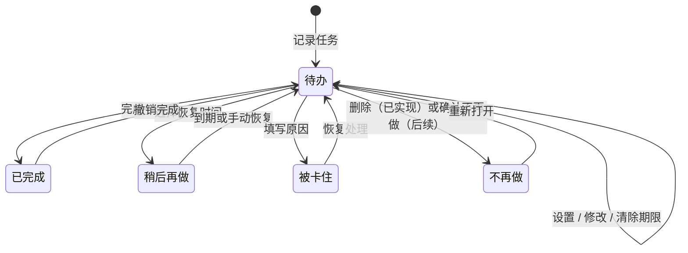

# 代办：任务状态与事件账本 v0.1

> 状态：第一版业务语义已冻结，并同步当前一级子代办本地实现
> 更新时间：2026-07-23
> 当前边界：顶层待办与一级子代办的创建、标题修改、完成、软删除、撤销和同级重排，以及 schema v5 与 v1 至 v4 → v5 迁移保护已实现；该子代办实现尚未作为新版本发布，完整任务状态和通用备份恢复仍未实现

## 1. 目标

这份文档固定三个不会随视觉皮肤变化的核心规则：

1. 用户想到事情时可以先记下，再按队列依次处理。
2. 一个顶层待办可以拆成一级子代办；父子标题修改、完成、删除和撤销都留下可追溯记录，历史可以直接生成周回顾。
3. 金币只来自真实完成，任何重复点击、撤销或异常恢复都不能重复发币。

极简原生、深色透明和像素桌宠未来必须共用本规则，不允许各自维护一套任务逻辑。

## 2. 统一术语

| 面向用户的称呼 | 内部语义 | 是否可成为当前任务 |
|---|---|---|
| 待办 | `pending` | 可以 |
| 稍后再做 | `pending` + `deferUntil` | 到期前不可以 |
| 被卡住 | `blocked` | 不可以 |
| 已完成 | `completed` | 不可以 |
| 不再做 | `abandoned` | 不可以 |

“当前任务”不是独立状态，而是队列中第一条可执行的待办。文档和界面不再混用“延后/阻塞/放弃”与多套口语按钮；技术说明可以使用“延期、阻塞、放弃”，面向用户统一显示“稍后再做、被卡住、不再做”。

“期限”也不是任务状态。`deadlineOn` 是可空 `YYYY-MM-DD` 日历日，默认 `null`；它不影响任务是否可执行。`deferUntil` 是后续“稍后再做”的恢复时间，会让任务暂时退出立即执行队列，两者不得互相推导或复用。

当前桌面的“删除”复用 `abandoned` 状态，但语义是固定的历史保留型删除：`reason=用户删除`、`metadata.action=delete`。它不是物理删除，也不等于后续“填写原因后不再做并可重新打开”的完整流程。

“父代办”是进入顶层执行队列的任务；“子代办”只允许一级，必须通过 `parentTaskId` 指向顶层父项并持有正数 `siblingPosition`，不能再包含子项。子项没有独立期限、延期、阻塞或顶层队列位置，也不会单独产生金币。

## 3. 状态流转

状态变化后的队列规则：

- 新任务永远进入队尾；没有当前任务时，新任务自动成为当前任务。
- 新子项追加到父项的同级位置末尾，只在父组内排序，不进入顶层队列；已完成子项保留原位置。
- 用户可手动调整立即待办顺序；调整后的第一条就是当前任务。
- 修改立即顶层待办或活动父项下的未完成子项标题，只更新当前展示标题并追加事件，不改变任务 ID、状态、位置或金币。
- 设置、修改或清除期限只更新 `deadlineOn` 并追加事件，不改变状态、队列位置、可执行性或金币。
- 期限到达、逾期和午夜跨日只改变前端展示标签，不自动排序、移出队列、提醒、通知、同步日历或写领域事件。
- 单独完成子项只改变该子项，不自动完成父项且不产生金币；用户勾选父项时，全部未完成有效子项与父项在同一事务中依次完成。
- 完成顶层待办后只移出目标父项，新的第一条自动成为当前任务，并产生一次金币奖励。
- 删除顶层或子项都保留任务投影和 `abandoned` 事件，不产生金币。删除父项不级联改写子项，但父组因父项离开顶层队列而从主列表隐藏。
- 稍后再做到期后进入队尾，不打断正在处理的当前任务。
- 被卡住和不再做进入独立集合，不占据执行队列。
- 恢复、重新打开和撤销完成都回到队尾，不插队。

## 4. 用具体轮次说明

### 第 1 轮：快速记录

输入“整理周报材料”并回车。

- 输入：任务标题。
- 输出：任务 ID、新建事件、队尾位置。
- 状态：`pending`。
- 不变式：记录过程不要求先选项目、标签或日期。

### 第 1.25 轮：拆成一级子代办

点击“整理周报材料”父行固定 `＋`，依次添加“汇总完成项”和“整理遗留问题”；每次创建成功后都保持列表展开并恢复固定新增入口。

- 输入：父项 ID、子项标题与稳定 `operationId`。
- 输出：带 `parentTaskId` / `siblingPosition` 的子项投影和 `subtask_created` 事件。
- 状态：子项为 `pending`，父项仍在原顶层位置。
- 不变式：父项必须是立即可执行的顶层待办；只允许一级；子项没有期限、延期、阻塞、顶层队列位置或奖励。

### 第 1.5 轮：修改未完成标题

把立即待办“整理周包”修改为“整理周报”。

- 输入：任务 ID、新标题与稳定 `operationId`。
- 输出：更新后的任务投影和 `title_updated` 事件；metadata 保存 `beforeTitle=整理周包` 与 `afterTitle=整理周报`。
- 状态：仍为 `pending`，稳定任务 ID、队列位置和金币不变。
- 不变式：接受立即顶层待办，或活动父项下的未完成子项；任务投影、标题事件和命令回执同事务提交。子项事件额外保存 `parentTaskId` / `parentTitle`；空白或相同标题不形成有效修改。

### 第 1.75 轮：设置、改期或清除期限

把待办“整理周报”的期限从无期限设为 `2026-07-20`，之后改为 `2026-07-21`，或者清空日期恢复无期限。

- 输入：任务 ID、`deadlineOn`（`null` 或 `YYYY-MM-DD`）与稳定 `operationId`。
- 输出：更新后的任务投影和 `deadline_updated` 事件；metadata 保存可空的 `beforeDeadlineOn` 与 `afterDeadlineOn`。
- 状态：仍为 `pending`，稳定任务 ID、标题、队列位置和金币不变。
- 不变式：只接受当前可见的立即待办；投影、期限事件和命令回执同事务提交；相同值显式拒绝。完成、撤销完成和删除不清空既有期限。
- 展示：无期限不显示；已有期限按今天、明天、`M/D`、跨年 `YYYY/M/D` 或“逾期 N 天”派生。展示跨日刷新不形成事件。

### 第 2 轮：完成任意待办

勾选统一列表中的任意一项。

- 输入：被勾选任务 ID。
- 输出：单独完成子项时生成 `subtask_completed` 且没有奖励交易；完成顶层父项时，先为其全部 `pending` 活动子项生成零奖励 `subtask_completed`，再生成父项 `completed` 与金币 `+1`。
- 状态：`pending → completed`。
- 不变式：父项与全部伴随子项的投影、完成事件、父项主命令回执和金币交易必须同事务成功或失败；已完成子项不重复写，已软删除子项忽略。最后一个子项单独完成仍不会自动完成父项。

### 第 2.5 轮：调整顺序

把第三项拖到第一项，或在排序柄上按 `Alt + ↑/↓`。

- 输入：移动任务 ID、调整前完整 ID 顺序、调整后完整 ID 顺序。
- 输出：顶层使用 `queue_reordered`；子项组内使用 `subtasks_reordered`，并保留父项范围和同级位置。
- 状态：仍为 `pending`，只改变执行顺序。
- 不变式：前后必须是同一无重复任务集合；子项还必须同属一个父项。软删子项保留历史位置，活动子项只在既有活动位置集合内重排。

### 第 2.75 轮：删除待办

点击某一待办行右侧的删除入口。

- 输入：目标任务 ID 与稳定 `operationId`。
- 输出：`abandoned` 事件和更新后的队列；事件固定保存“用户删除”原因与 `action=delete` 元数据。
- 状态：顶层或子项 `pending → abandoned`，通过 `TaskWrite::Update` 更新投影，不物理删除任务或历史。
- 不变式：任务投影、事件和命令回执同事务提交；没有奖励交易。删除父项不级联删除子项，删除子项不回收其历史同级位置。

### 第 3 轮：任务被卡住

选择“被卡住”，填写“等待产品确认验收口径”。

- 输入：任务 ID、必填原因。
- 输出：被卡住事件、阻塞区记录、下一条当前任务。
- 状态：`pending → blocked`。
- 不变式：原因不能为空；不扣金币；恢复后回队尾。

### 第 4 轮：稍后再做

选择“稍后再做”，恢复时间为“下周一”。

- 输入：任务 ID、恢复时间、可选说明。
- 输出：延期事件和 `deferUntil`。
- 状态：仍为 `pending`，但到期前不可执行。
- 不变式：到期只回队尾，不抢占当前任务。

### 第 5 轮：撤销完成

在完成历史中点击“撤销”。

- 输入：原完成事件 ID。
- 输出：顶层生成 `completion_undone`、金币 `-1` 并回到顶层队尾；子项生成 `subtask_completion_undone`、回到原同级位置且无奖励交易。
- 状态：`completed → pending`。
- 不变式：旧完成事件不删除；用新事件纠正。父项已完成时不能直接撤销子项，必须先撤销父项；顶层净奖励始终只有一次，子项奖励净值始终为零。

## 5. 事件账本

任务历史采用只追加事件，不直接改写过去。每条 `TaskEvent` 至少包含：

| 字段 | 含义 |
|---|---|
| `id` | 事件唯一 ID |
| `taskId` | 任务唯一 ID |
| `titleSnapshot` | 事件发生时的标题快照 |
| `type` | 顶层/子项新建、标题/期限修改、顶层/子项完成与撤销、顶层/子项重排、稍后、恢复、卡住、不再做/删除、重新打开 |
| `occurredAt` | 实际发生时间 |
| `reason` | 卡住或调整原因 |
| `metadata` | 标题修改前后值、期限修改前后值、恢复时间等扩展信息 |

金币使用独立的 `RewardTransaction` 账本，至少包含 `taskEventId`、金额、类型和交易后余额。任务事件和金币交易通过事件 ID 关联，不能根据当前任务状态重新计算并补发。

schema v5 新增 `subtask_created`、`subtask_completed`、`subtask_completion_undone`、`subtasks_reordered`。子项的创建、标题修改、完成、撤销、删除与重排事件都记录 `parentTaskId` 和事件发生时的 `parentTitle`；完整性检查会把这些元数据与任务层级和父项标题历史对照。

父项级联完成仍只有一个外部 `operationId` 和一份指向父 `completed` 事件的主命令回执。伴随子完成事件使用内部 `commandId=cascade/<eventId>`，通过 `cascadeCommandId`、`cascadeParentEventId` 与父事件的 `cascadeSubtaskEventIds` 双向关联；父事件必须最后写入。完整性检查显式校验事件类型、时序、双向索引、主回执与零子项坏类型边界，不把伴随事件误判成缺失用户命令回执。

账本快照区分“当前事实”和“有限审计窗口”：

- `queue` / `currentTask` 只包含顶层立即待办，主列表只按它们建立父组。
- `subtasks` 包含所有未软删的 `pending` / `completed` 子项，即使父项已经完成或软删；因此历史组总数不因父项离开主队列而丢失。
- `effectiveCompletions` 由任务的 `activeCompletionEventId` 连接事件表，返回全部当前有效的顶层/子项完成事实，按最新事实优先排列。
- `events` 仍只返回最近 100 条审计事件；界面不得从这段截断日志反推完成记录或父子组。

## 6. 周报生成

当前“复制本周完成”直接查询当前有效完成投影，不扫描 `snapshot.events`：

1. 顶层完成事件必须发生在 `[本周一 00:00, 下周一 00:00)`。
2. 普通进行中父项只返回本周发生的当前有效子项完成。
3. 如果父项本周完成，则额外返回该父项所有当前有效的子项完成，即使子项在前几周完成；这样一次父项完成可以输出完整组事实。
4. 已撤销的顶层或子项完成因不再是 `activeCompletionEventId` 而自动排除；进行中列表仍只包含当前顶层待办。

基础周报完全离线，不依赖 AI。AI 后续只能整理表达，不能成为历史事实来源。

## 7. 第一版不变式

- 每个任务都有稳定 ID，重复标题仍是不同任务。
- 层级只允许一级：顶层没有父项和同级位置；子项必须指向顶层父项并持有唯一正数 `siblingPosition`，禁止孙级。子项不得携带顶层队列、期限、延期或阻塞字段。
- 标题修改只允许立即顶层待办或活动父项下的未完成子项；必须追加 `title_updated` 并保存 `beforeTitle` / `afterTitle`，不得覆盖旧事件，也不得改变状态、顺序或金币。
- 期限修改只允许当前可见的立即待办；必须通过 `update_task_deadline({ operationId, taskId, deadlineOn })` 追加 `deadline_updated` 并保存可空的 `beforeDeadlineOn` / `afterDeadlineOn`。同值拒绝，完成、撤销和删除保留字段。
- `deadlineOn` 与 `deferUntil` 独立；期限及逾期不自动排序、隐藏、提醒、通知、同步日历或奖惩。午夜刷新只更新前端派生标签。
- 当前任务必须是第一条可执行待办。
- 子项不进入顶层队列；单独完成子项不擅自重排其他待办。父项完成会原子完成全部仍为 `pending` 的有效子项并移出父组；最后一个子项单独完成不自动完成父项。
- 顶层和子项重排必须提交各自范围内调整前后的完整任务集合，不能逐行产生中间顺序；完成或软删不回收子项历史位置。
- 空队列时没有可勾选任务，“暂时做不了”入口不可用。
- 卡住和不再做必须填写原因。
- 顶层完成与撤销写入相反的金币交易，余额不能为负；子项完成/撤销始终无奖励。未来加入消费后，如果撤销会导致负余额，必须整笔失败，不能静默截成 `0`。
- 金币只由顶层完成产生；子项、稍后、卡住、不再做和删除均不奖不罚。
- 父项完成时禁止直接撤销其子项，必须先撤销父项。
- 删除不得物理移除任务、事件或奖励；父项删除不级联删除子项，子项删除保留父项关系与历史位置。
- `snapshot.subtasks` / `effectiveCompletions` 和 `weekly_facts` 是父子组事实来源；不得从最近 100 条 `events` 猜测被截断的当前事实。
- 宠物不死亡、不掉级，也不因长期未使用责备用户。
- 退出应用后不能从系统托盘恢复；隐藏到托盘仍可恢复。
- 三种视觉皮肤共享同一状态机、事件类型和数据接口。

## 8. 已演示与待实现

当前本地源码已经实现：

- SQLite v5 任务投影、只追加事件、只追加奖励交易和命令回执；v1 至 v4 文件先生成并验证 before-v5 一致性备份，再逐级迁移到 v5。
- `SubtaskController` 的展开、单次添加、标题编辑、同组拖动/键盘重排和焦点恢复，以及父组删除确认。
- `create_subtask`、`reorder_subtasks` 独立命令，以及标题修改、完成、删除、撤销共享命令的操作箱、IPC、应用服务、领域转换和原子提交链路。
- 一级层级、父项单事务级联完成、子项零奖励、父完成时阻止子撤销、父/子软删除和同级位置保留规则。
- `snapshot.subtasks`、全量 `effectiveCompletions`、有限审计 `events` 的分离读取契约，以及父项本周完成时补齐跨周子完成的周回顾事实。
- 层级形态、父项元数据、事件、奖励、投影、命令回执和迁移结构的完整性校验。

上述一级子代办能力目前只在本地源码中，尚未作为新版本发布，不能据此把现有安装版描述为已经支持子代办。

仍需在阶段 1 实现：

- 稍后再做、到期恢复、被卡住、带原因的不再做和重新打开的正式持久化命令与桌面入口；当前删除只实现固定原因的 `abandoned` 变体。
- 通用自动本地备份、用户导出和安全恢复。
- 延期到期调度与跨时区处理。
- 宠物喂食消费事件及“余额不足时撤销整笔失败”的完整规则。
- 新版本发布、真实安装/自动更新闭环、完整多屏验证和可日常使用的产品收口。

技术证据和当前边界见[《本地事件历史、金币账本与异常恢复技术实验 v0.1》](./本地事件历史、金币账本与异常恢复技术实验-v0.1.md)。本实验通过不等于阶段 1 已完成，仍不能把当前版本表述为可日常使用的正式产品。
