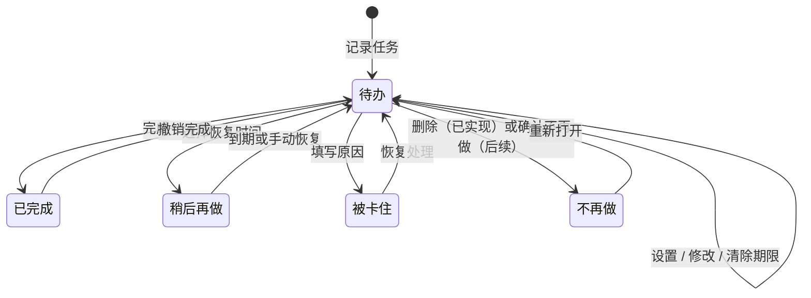

# 代办：任务状态与事件账本 v0.1

> 状态：第一版业务语义已冻结，用于桌面技术原型与阶段 1 开发拆分  
> 更新时间：2026-07-18  
> 当前边界：创建、未完成标题修改、待办可选期限、任意待办完成、历史保留型删除、队列重排、撤销、schema v4 与 v1/v2/v3→v4 迁移保护已实现；完整任务状态和通用备份恢复仍未实现

## 1. 目标

这份文档固定三个不会随视觉皮肤变化的核心规则：

1. 用户想到事情时可以先记下，再按队列依次处理。
2. 标题或期限修改、完成、稍后、卡住和不再做都留下可追溯记录，历史可以直接生成周报。
3. 金币只来自真实完成，任何重复点击、撤销或异常恢复都不能重复发币。

极简原生、深色透明和像素桌宠未来必须共用本规则，不允许各自维护一套任务逻辑。

## 2. 统一术语

| 面向用户的称呼 | 内部语义 | 是否可成为当前任务 |
|---|---|---|
| 待办 | `pending` | 可以 |
| 稍后再做 | `pending` + `deferUntil` | 到期前不可以 |
| 被卡住 | `blocked` | 不可以 |
| 已完成 | `completed` | 不可以 |
| 不再做 | `abandoned` | 不可以 |

“当前任务”不是独立状态，而是队列中第一条可执行的待办。文档和界面不再混用“延后/阻塞/放弃”与多套口语按钮；技术说明可以使用“延期、阻塞、放弃”，面向用户统一显示“稍后再做、被卡住、不再做”。

“期限”也不是任务状态。`deadlineOn` 是可空 `YYYY-MM-DD` 日历日，默认 `null`；它不影响任务是否可执行。`deferUntil` 是后续“稍后再做”的恢复时间，会让任务暂时退出立即执行队列，两者不得互相推导或复用。

当前桌面的“删除”复用 `abandoned` 状态，但语义是固定的历史保留型删除：`reason=用户删除`、`metadata.action=delete`。它不是物理删除，也不等于后续“填写原因后不再做并可重新打开”的完整流程。

## 3. 状态流转

状态变化后的队列规则：

- 新任务永远进入队尾；没有当前任务时，新任务自动成为当前任务。
- 用户可手动调整立即待办顺序；调整后的第一条就是当前任务。
- 修改立即待办标题只更新当前展示标题并追加事件，不改变任务 ID、状态、队列位置或金币。
- 设置、修改或清除期限只更新 `deadlineOn` 并追加事件，不改变状态、队列位置、可执行性或金币。
- 期限到达、逾期和午夜跨日只改变前端展示标签，不自动排序、移出队列、提醒、通知、同步日历或写领域事件。
- 完成任意一条待办后只移出目标任务，新的第一条自动成为当前任务。
- 删除任意一条立即待办后只移出目标任务，保留任务投影和 `abandoned` 事件，不产生金币。
- 稍后再做到期后进入队尾，不打断正在处理的当前任务。
- 被卡住和不再做进入独立集合，不占据执行队列。
- 恢复、重新打开和撤销完成都回到队尾，不插队。

## 4. 用具体轮次说明

### 第 1 轮：快速记录

输入“整理周报材料”并回车。

- 输入：任务标题。
- 输出：任务 ID、新建事件、队尾位置。
- 状态：`pending`。
- 不变式：记录过程不要求先选项目、标签或日期。

### 第 1.5 轮：修改未完成标题

把立即待办“整理周包”修改为“整理周报”。

- 输入：任务 ID、新标题与稳定 `operationId`。
- 输出：更新后的任务投影和 `title_updated` 事件；metadata 保存 `beforeTitle=整理周包` 与 `afterTitle=整理周报`。
- 状态：仍为 `pending`，稳定任务 ID、队列位置和金币不变。
- 不变式：只接受立即待办；任务投影、标题事件和命令回执同事务提交；空白或相同标题不形成有效修改，重复提交同一请求只重放回执。

### 第 1.75 轮：设置、改期或清除期限

把待办“整理周报”的期限从无期限设为 `2026-07-20`，之后改为 `2026-07-21`，或者清空日期恢复无期限。

- 输入：任务 ID、`deadlineOn`（`null` 或 `YYYY-MM-DD`）与稳定 `operationId`。
- 输出：更新后的任务投影和 `deadline_updated` 事件；metadata 保存可空的 `beforeDeadlineOn` 与 `afterDeadlineOn`。
- 状态：仍为 `pending`，稳定任务 ID、标题、队列位置和金币不变。
- 不变式：只接受当前可见的立即待办；投影、期限事件和命令回执同事务提交；相同值显式拒绝。完成、撤销完成和删除不清空既有期限。
- 展示：无期限不显示；已有期限按今天、明天、`M/D`、跨年 `YYYY/M/D` 或“逾期 N 天”派生。展示跨日刷新不形成事件。

### 第 2 轮：完成任意待办

勾选统一列表中的任意一项。

- 输入：被勾选任务 ID。
- 输出：完成事件、金币 `+1` 交易和更新后的队列第一项。
- 状态：`pending → completed`。
- 不变式：任务状态、完成事件和金币交易必须在同一事务内成功或失败。

### 第 2.5 轮：调整顺序

把第三项拖到第一项，或在排序柄上按 `Alt + ↑/↓`。

- 输入：移动任务 ID、调整前完整 ID 顺序、调整后完整 ID 顺序。
- 输出：`queue_reordered` 事件、连续队列位置和新的第一项。
- 状态：仍为 `pending`，只改变执行顺序。
- 不变式：前后必须是同一无重复任务集合；位置、事件和回执在一个事务内提交。

### 第 2.75 轮：删除待办

点击某一待办行右侧的删除入口。

- 输入：目标任务 ID 与稳定 `operationId`。
- 输出：`abandoned` 事件和更新后的队列；事件固定保存“用户删除”原因与 `action=delete` 元数据。
- 状态：`pending → abandoned`，通过 `TaskWrite::Update` 更新投影，不物理删除任务或历史。
- 不变式：任务投影、事件和命令回执同事务提交；没有奖励交易，重复提交同一请求只重放回执。

### 第 3 轮：任务被卡住

选择“被卡住”，填写“等待产品确认验收口径”。

- 输入：任务 ID、必填原因。
- 输出：被卡住事件、阻塞区记录、下一条当前任务。
- 状态：`pending → blocked`。
- 不变式：原因不能为空；不扣金币；恢复后回队尾。

### 第 4 轮：稍后再做

选择“稍后再做”，恢复时间为“下周一”。

- 输入：任务 ID、恢复时间、可选说明。
- 输出：延期事件和 `deferUntil`。
- 状态：仍为 `pending`，但到期前不可执行。
- 不变式：到期只回队尾，不抢占当前任务。

### 第 5 轮：撤销完成

在完成历史中点击“撤销”。

- 输入：原完成事件 ID。
- 输出：撤销完成事件、金币 `-1` 交易、回到队尾的任务。
- 状态：`completed → pending`。
- 不变式：旧完成事件不删除；用新事件纠正，净奖励始终只有一次。

## 5. 事件账本

任务历史采用只追加事件，不直接改写过去。每条 `TaskEvent` 至少包含：

| 字段 | 含义 |
|---|---|
| `id` | 事件唯一 ID |
| `taskId` | 任务唯一 ID |
| `titleSnapshot` | 事件发生时的标题快照 |
| `type` | 新建、标题修改、期限修改、完成、撤销完成、队列重排、稍后、到期恢复、卡住、恢复、不再做/删除、重新打开 |
| `occurredAt` | 实际发生时间 |
| `reason` | 卡住或调整原因 |
| `metadata` | 标题修改前后值、期限修改前后值、恢复时间等扩展信息 |

金币使用独立的 `RewardTransaction` 账本，至少包含 `taskEventId`、金额、类型和交易后余额。任务事件和金币交易通过事件 ID 关联，不能根据当前任务状态重新计算并补发。

## 6. 周报生成

周报只读取选定日期范围内的事件，并按以下分组生成：

1. 已完成：范围内有效的完成事件，排除已经撤销的净结果。
2. 进行中：截至范围结束仍可执行的待办。
3. 被卡住：保留任务标题、原因和卡住时间。
4. 计划调整：稍后再做、不再做、重新打开和恢复处理。
5. 下周计划：根据当前队列生成可编辑草稿。

基础周报完全离线，不依赖 AI。AI 后续只能整理表达，不能成为历史事实来源。

## 7. 第一版不变式

- 每个任务都有稳定 ID，重复标题仍是不同任务。
- 标题修改只允许立即待办；必须追加 `title_updated` 并保存 `beforeTitle` / `afterTitle`，不得覆盖旧事件，也不得改变状态、顺序或金币。
- 期限修改只允许当前可见的立即待办；必须通过 `update_task_deadline({ operationId, taskId, deadlineOn })` 追加 `deadline_updated` 并保存可空的 `beforeDeadlineOn` / `afterDeadlineOn`。同值拒绝，完成、撤销和删除保留字段。
- `deadlineOn` 与 `deferUntil` 独立；期限及逾期不自动排序、隐藏、提醒、通知、同步日历或奖惩。午夜刷新只更新前端派生标签。
- 当前任务必须是第一条可执行待办。
- 任意完成只改变目标任务，不擅自重排其他待办。
- 队列重排必须提交调整前后的完整任务集合，不能逐行产生中间顺序。
- 空队列时没有可勾选任务，“暂时做不了”入口不可用。
- 卡住和不再做必须填写原因。
- 完成、撤销完成、喂食都写入金币交易账本，余额不能为负；未来加入消费后，如果撤销会导致负余额，必须整笔失败，不能静默截成 `0`。
- 金币只由完成产生；稍后、卡住、不再做和删除均不奖不罚。
- 删除不得物理移除任务、事件或奖励；当前实现必须保留 `abandoned` 投影、固定原因与删除动作元数据。
- 宠物不死亡、不掉级，也不因长期未使用责备用户。
- 退出应用后不能从系统托盘恢复；隐藏到托盘仍可恢复。
- 三种视觉皮肤共享同一状态机、事件类型和数据接口。

## 8. 已演示与待实现

极简原生原型当前已经演示：快速记录、顺序切换、空队列保护、完成与撤销奖励、三种任务分流、原因记录、恢复到队尾、周报草稿、金币喂食，以及收起/隐藏/退出的区别。

第二个技术实验已经实现并验证：

- SQLite 任务快照、只追加事件、只追加奖励交易和命令回执。
- 创建、未完成标题修改、待办期限修改、任意完成、历史保留型删除、队列重排、撤销完成的原子事务。
- 重复命令幂等、不同请求复用命令 ID 显式失败；同一任务被两个连接并发完成时只成功一次，不同任务的完成与撤销并发后余额和队尾仍一致。
- 四个事务失败注入点、提交前子进程强制退出、提交后丢响应使用同一 ID 重放、重开恢复和领域完整性校验。
- 按时间范围查询有效完成事实，已经撤销的完成会被排除。
- schema v2 增加 `queue_reordered`，schema v3 增加 `title_updated`，schema v4 增加可空 `deadlineOn` 投影与 `deadline_updated`；真实填充的 v1、v2、v3 磁盘文件升级前生成 before-v4 一致性备份，并按级迁移到 v4，旧回执和旧事件继续可用。
- 标题修改通过 `update_task_title({ operationId, taskId, title })` 进入操作箱和统一账本写链路；完整性检查对照 `beforeTitle`、历史当前标题、`titleSnapshot`、`afterTitle`、任务投影和命令回执。
- 期限修改通过 `update_task_deadline({ operationId, taskId, deadlineOn })` 进入同一可靠写链路；完整性检查回放 `beforeDeadlineOn` / `afterDeadlineOn` 并与任务投影和命令回执对照。
- 删除继续沿用自 schema v2 起已有的 `abandoned` 状态和事件类型；当前 v3 不为删除另增事件类型。前端通过 `delete_task({ operationId, taskId })` 进入操作箱和统一账本写链路。
- 当前统一门禁 79 个前端测试、48 个 Rust 测试全部通过；独立账本冒烟和桌面联合冒烟均为 `passed=true`，联合冒烟覆盖未完成标题与期限修改、`updatedPendingTaskDeadline=true`、删除后事件数 9、零额外奖励和完整性校验。

仍需在阶段 1 实现：

- 稍后再做、到期恢复、被卡住、带原因的不再做和重新打开的正式持久化命令与桌面入口；当前删除只实现固定原因的 `abandoned` 变体。
- 通用自动本地备份、用户导出和安全恢复。
- 延期到期调度与跨时区处理。
- 宠物喂食消费事件及“余额不足时撤销整笔失败”的完整规则。
- 正式安装、v4 之后的更多升级路径、完整多屏验证和可日常使用的产品收口。

技术证据和当前边界见[《本地事件历史、金币账本与异常恢复技术实验 v0.1》](./本地事件历史、金币账本与异常恢复技术实验-v0.1.md)。本实验通过不等于阶段 1 已完成，仍不能把当前版本表述为可日常使用的正式产品。
