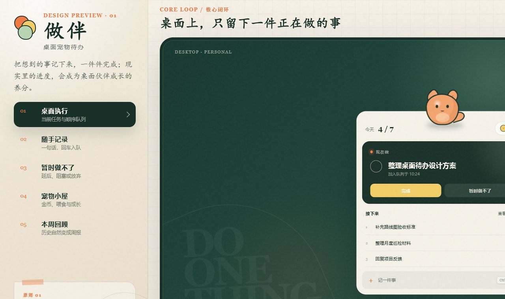
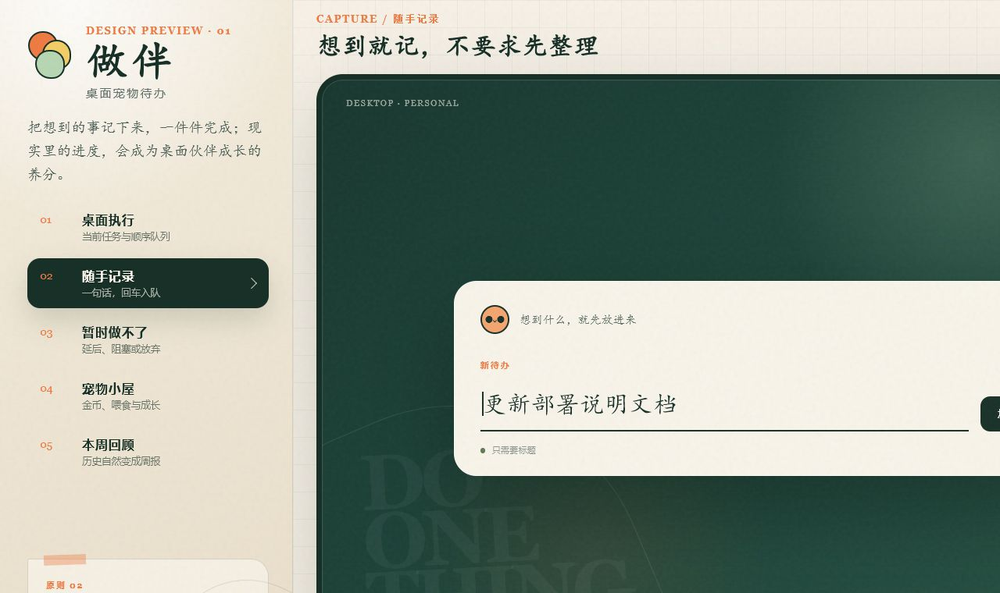
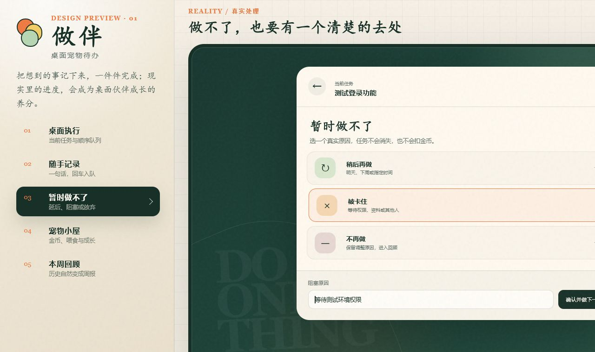
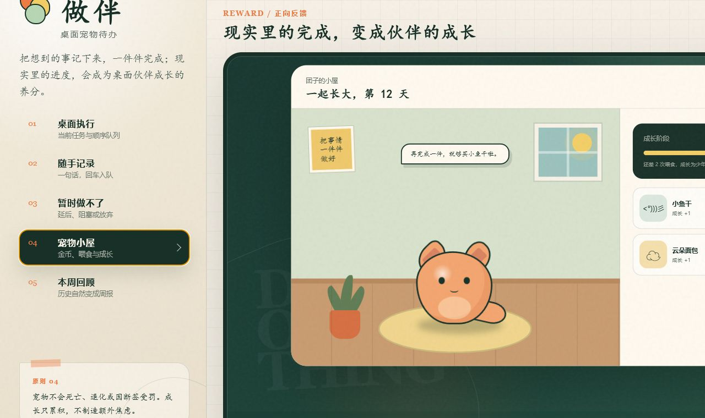
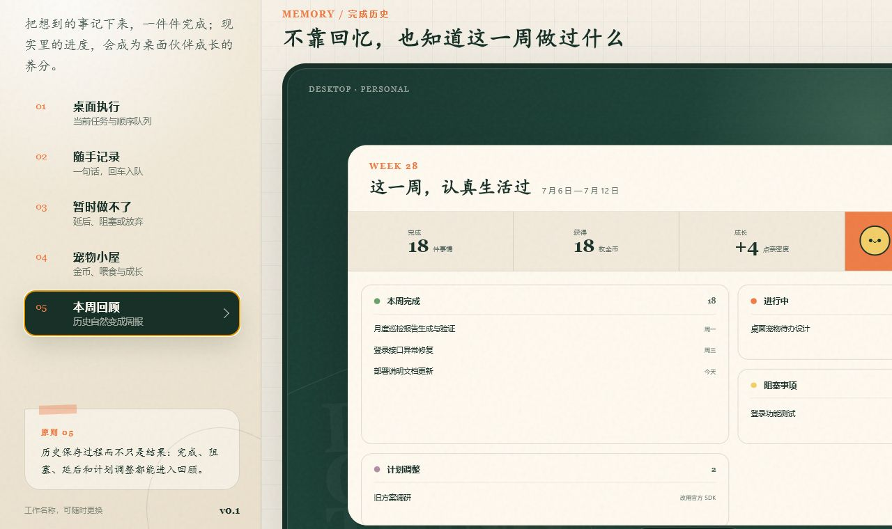

# 代办：界面与交互设计说明 v0.1

> 设计阶段：核心闭环高保真稿  
> 当时暂定名称：做伴；当前名称：代办  
> 可交互入口：[`prototype/index.html`](../prototype/index.html)

> 后续更新：本文件保留第一轮暖色手账风设计。当前可用行为以[《界面与交互设计说明 v0.2》](./界面与交互设计说明-v0.2.md)为准：托盘统一打开完整面板，待办行支持软删除，整窗鼠标穿透已移除。三种新视觉方向及统一比较入口见[《视觉风格对比 v0.2》](./视觉风格对比-v0.2.md)。

## 1. 设计方向

视觉主题采用“温暖的桌面工作角落”：深森林绿代表安静工作的桌面，米白纸张和手写感标题代表日常记录，橙色宠物与黄色金币提供短暂、明确的情绪反馈。

设计关键词：

- 温暖，但不幼稚。
- 有生命感，但不吵闹。
- 像桌面伙伴，不像效率监工。
- 当前任务突出，其他信息主动退后。
- 养成反馈有趣，任务事实保持严谨。

本稿当时使用“做伴”，表达做完待办和伙伴陪伴两层含义。当前产品名称已确定为“代办”；这里保留旧命名背景作为历史记录。

## 2. 视觉系统

| 角色 | 颜色 | 用途 |
|---|---|---|
| 主墨绿 | `#183128` | 当前任务、主按钮、重要结构 |
| 桌面森林绿 | `#17372F` | 安静的桌面背景 |
| 米白 | `#FFFaf0` | 悬浮窗和内容表面 |
| 宠物橙 | `#EF7C45` | 宠物、重要状态和品牌记忆点 |
| 金币黄 | `#F3CE67` | 完成奖励与金币 |
| 嫩叶绿 | `#B8D7B4` | 成长、成功和自然元素 |

标题使用偏手写的中文楷体风格，正文使用清晰的中文无衬线字体；数字与英文辅助信息使用衬线字体，形成“日常手账 + 稳定工具”的混合气质。

## 3. 第一套设计图

### 3.1 桌面执行



重点：

- 宠物停留在当前任务窗上方，形成明确记忆点。
- 当前只突出一件任务；后续仅预览三项。
- 完成和“暂时做不了”并列，后者不是隐藏在更多菜单中的次要操作。
- 快速新增固定在底部，但不抢占当前任务视觉层级。
- 金币只显示余额，不在任务悬浮层展示商店信息。

完成任务后的交互顺序：

```text
勾选完成
→ 短暂显示金币 +1
→ 宠物庆祝一次
→ 写入历史和奖励账本
→ 下一条任务自然上移
```

### 3.2 随手记录



重点：

- 输入框是唯一视觉中心。
- 只要求标题，不提前出现日期、标签和项目。
- 明确告诉用户新事项会进入队尾，不会打断当前任务。
- 支持全局快捷键唤起、回车保存、`Esc` 退出。

### 3.3 暂时做不了



三种正式去向：

| 操作 | 结果 | 周报归类 |
|---|---|---|
| 稍后再做 | 保持待处理，恢复时间前跳过 | 计划调整 |
| 被卡住 | 退出可执行队列，等待恢复 | 阻塞事项 |
| 不再做 | 进入已放弃终态，可重新打开 | 计划调整 |

交互要求：

- 先选择处理类型，再填写必要时间或原因。
- 确认后自动切换到下一项。
- 不发金币、不扣金币，不触发宠物负面反馈。
- 当前版本的行内“×”执行软删除：从待办队列移除，保留事件历史，不发金币；后续若增加“放弃”，再提供不同入口和原因语义。

### 3.4 宠物小屋



重点：

- 第一版只展示金币、食物和成长阶段。
- 不引入饥饿值、生命值和倒计时压力。
- 喂食后必须同时更新金币账本与成长值。
- 金币不足只给温和提示，不催促、不惩罚。
- 房间和装饰提供情绪价值，但不抢占第一版范围。

### 3.5 本周回顾



重点：

- 完成、进行中、阻塞和计划调整同时出现。
- 周报不只是已完成标题列表，还保留阻塞和调整原因。
- 本周完成数、金币收入和成长变化形成现实与虚拟进度的对应关系。
- “复制周报”生成可编辑草稿，不改变原始历史。

## 4. 桌面悬浮状态

第一版实现时需要覆盖三个层级：

### 宠物独立态

只显示宠物。适合任务为空、用户主动极简化或贴边收起后的状态。

```text
  ᓚᘏᗢ
```

### 当前任务胶囊态

默认长期停留状态，只显示宠物、当前任务和完成入口。

```text
  ᓚᘏᗢ  ☐ 整理巡检报告
```

### 队列展开态

用户主动展开时显示当前任务、后续三项、金币和快速新增。完整历史与宠物小屋仍在主窗口中打开。

## 5. 关键交互约束

- 从任意桌面状态记录一件事，只需要快捷键、输入、回车。
- 完成当前任务后自动显示下一项，但不自动启动计时。
- 延后、阻塞和放弃均写入事件历史。
- 完成支持撤销；删除采用保留历史的软删除，当前不提供前端撤销入口。
- 完成奖励由本地确定规则计算，宠物动画只展示结果。
- 宠物可以拖动，但任务窗口位置保持稳定。
- 宠物不能遮挡输入框和主要按钮。
- 通知不抢焦点，不因逾期持续闪烁。
- 周报允许选择纳入项并继续编辑。

## 6. 动效原则

- 待机：轻微呼吸和尾巴摆动，周期较长。
- 完成：一次跳跃与金币上浮，总时长不超过 800 毫秒。
- 喂食：一次开心反馈与成长条变化。
- 页面切换：淡入与小幅位移，不使用大面积弹跳。
- 连续完成：合并金币提示，避免重复打断。
- 支持“减少动态效果”，关闭非必要动画。

## 7. 后续需要补画的实现状态

当前高保真稿已经覆盖核心闭环。进入开发前还需要补齐以下状态稿：

- 宠物独立态、当前任务胶囊态和贴边收起态。
- 空任务、任务很多和超长标题。
- 多行迁移预览、重复标题提示和迁移结果。
- 无历史、跨月周报和单条任务事件详情。
- 金币不足、撤销完成和奖励回退。
- 本地备份失败、恢复预览和恢复失败。
- 全屏自动隐藏与多显示器位置恢复。

这些属于实现状态补全，不改变当前产品主流程。
